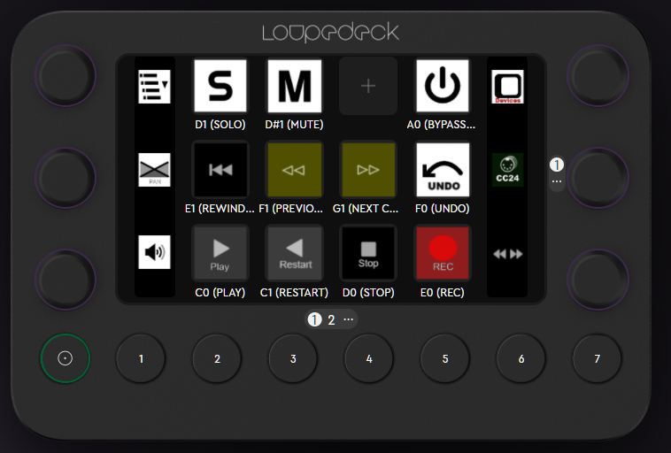

# What is this?

Controller Script for Bitwig Studio (https://www.bitwig.com/), which supports Loupedeck Live (https://loupedeck.com/products/loupedeck-live/) more solid.

# Install
- Copy `Loupedeck Live.control.js` to your Bitwig Studio Controller Scripts directory.
  - You can check where is that directory by Settings-Location-My Controller Script
- Load profile `bitwig-loupedeck.lp5` with your Loupedeck Live Editor
- Startup Bitwig Studio (if not yet)
- Assign proper bitwig studio process to loaded profile
- in Bitwig Studio, Settings-Controller, Add Controller to add Loupedeck Live, and assign proper MIDI port (of Loupedeck Live)

# What can this script do?

## Editing Track

- Track choice (Left-Top Encoder)
Rotate to choose working track.

- Pan edit (Left-Middle Encoder)
Rotate to change pan setting of working track.

- Volume edit (Left-Bottom Encoder)
Rotate to change volume setting of working track.

- SOLO (Top-1st Button)
Push to toggle SOLO of working track.

- MUTE (Top-2nd Button)
Push to toggle MUTE of working track.

## Editing Device

- Device choice (Right-Top Encoder)
Rotate to choose device, but it is not visible when device panel is not activated.
so, you can push this encoder to toggle/enable device panel.

- Toggle Device Bypass (Top-4th Button)
Push to toggle bypass/active of selected device

## Smooth RECording

- Just REC Start (Bottom-4th Button)
Push to start REC. It enables REC and start playback simultaneously.
You ARM channel to record, just this REC button to start REC.

- Undo (Middle-4th Button)
Push to undo (the same as Ctrl-Z or so).
Use this undo and REC and stop cooperatively for stress-free recording

## Classical Transport

- PLAY (Bottom-1st Button)
Push to start playback. If already in playback state, this stops playback and move playstart marker to current.

- RESTART (Bottom-2nd Button)
Push to start playback, If already in playback state, this rewind play position to playstart marker (with continued playback). It's not regular playback behavior of Bitwig but I think this is useful for reviewing.

- STOP (Buttom-3rd Button)
Push to stop playback.

- REWIND (Middle-1st Button)
Push to rewind to head of the track.

- PREVIOUS CUE MARKER (Middle-2nd Button)
Push to move playstart marker to previous cue marker. If it's in playback state, you cannot move to more than 2 cue marker before (current limitation sorry)

- NEXT CUE MARKER (Middle-3rd Button)
Push to move playstart marker to next cue marker.

# Contribution etc
Every comment, request, report, pull-requets helps.
